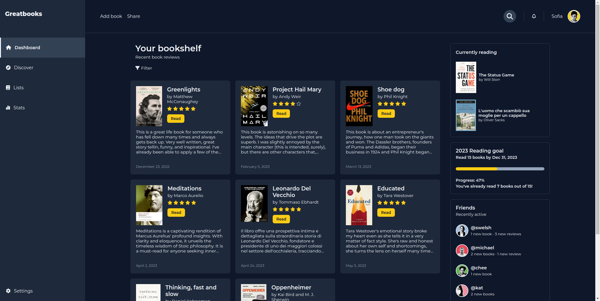

# Dashboard - Greatbooks

This project involves creating a dashboard using HTML and CSS, with the primary goal of gaining hands-on experience with the `grid` layout and its associated properties. Throughout this assignment, my aim was not only to develop proficiency in utilizing `grid` but also to construct something personally meaningful. As a result, I decided to offer a sneak peek into my ultimate project aspiration: a social media platform tailored for book enthusiasts.

## Demo

[Live Demo](https://sofiabaezzato.github.io/dashboard/)

## Features

- User-friendly and responsive user interface.
- A nice search bar animation `:)`
- **The dashboard offers limited possible interactions, as it wasn't the primary focus of this project.**

## Project Reflections

1. I have gained a comprehensive understanding of effectively utilizing `grid` and creating a naturally responsive webpage from scratch. I have minimized the reliance on media queries whenever possible.
2. One nice thing I noticed is that a few weeks ago, I was more engaged in trial and error, whereas now I approach my coding with greater intentionality and precision.